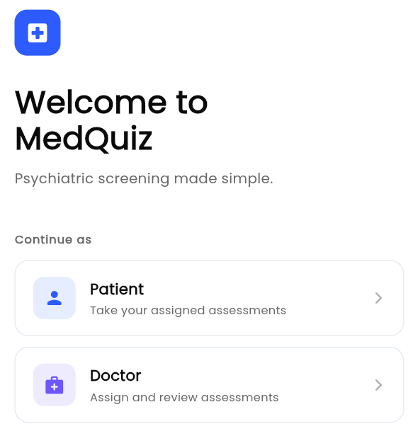

# MedQuiz

[](https://github.com/omprxkash/flutter-app-hci/actions/workflows/ci.yml)
[](https://flutter.dev)

Psychiatric screening shouldn't mean chasing patients down with paper forms. MedQuiz lets doctors send PHQ-9s, GAD-7s, and MMSEs straight to patients' phones. Patients fill them out on their own time, the app handles all the scoring, and doctors can review results — and override them when the numbers don't quite match what they heard in the room.

Built for an HCI course, but designed like something you'd actually want to use.

---

## Welcome screen



---

## How it works

The flow is pretty straightforward:

1. **Doctor logs in** and sees their patient list
2. **Doctor assigns a quiz** to a patient (PHQ-9, GAD-7, MMSE, or a custom one)
3. **Patient opens the app**, sees the quiz waiting, and fills it out
4. **The app scores it automatically** and shows the patient where they land on the severity scale
5. **Doctor reviews the result**, adjusts the score if needed, and adds any notes

No paper. No chasing people down. No manual scoring. The whole thing runs in-memory by default, so you can try it out without touching a database or Firebase project.

---

## Running it locally

You'll need Flutter 3.44 or later. Then:

```bash
git clone https://github.com/omprxkash/flutter-app-hci.git
cd flutter-app-hci
flutter pub get
flutter run -d chrome
```

Want a specific port?

```bash
flutter run -d web-server --web-port 8765
```

---

## Quizzes included

| Quiz | Screens for | Score range |
|---|---|---|
| PHQ-9 | Depression | 0–27 |
| GAD-7 | Anxiety | 0–21 |
| MMSE | Cognitive impairment | 0–30 |

Scoring follows the published clinical rubrics — no guesswork. Doctors can also build their own questionnaires from scratch using six question types: text, single-choice, multi-select, scale, number, and yes/no.

One thing worth calling out: if a patient's PHQ-9 has a non-zero answer on Q9 (the suicidal ideation item), the doctor dashboard surfaces a red alert banner at the top of the screen. That felt important to get right, even for a course project.

---

## Data and persistence

Out of the box, everything lives in-memory — data resets on restart, which is fine for exploring the app.

When you're ready to add real persistence, run `flutterfire configure` and drop the generated file in `lib/core/config/firebase_options.dart`. The app picks it up automatically from there, no other changes needed.

---

## Tech stack

- **Flutter 3.44 / Dart 3.10**
- **Riverpod 3** for state — one provider file per feature, no god-files
- **go_router 17** with `StatefulShellRoute` for persistent bottom nav
- **google_fonts** — Poppins throughout, centralized in `AppTypography`
- **Firebase Auth + Firestore** — optional, swappable with the in-memory layer

The architecture is feature-first: `auth`, `doctor`, `patient`, and `quiz` each get their own `domain/`, `data/`, and `presentation/` folders. The domain layer has zero Flutter imports. In-memory and Firebase implementations live side by side in `data/` — switching between them is a one-liner in the provider.

---

## What's next

A few things still on the list:

- Push notifications for patients who haven't started an assigned quiz after a day or two
- Score trend sparklines on the patient detail screen (last 6 results)
- An audit log when a doctor overrides the auto-score
- Real SMS verification once Firebase Auth is fully wired in

---

