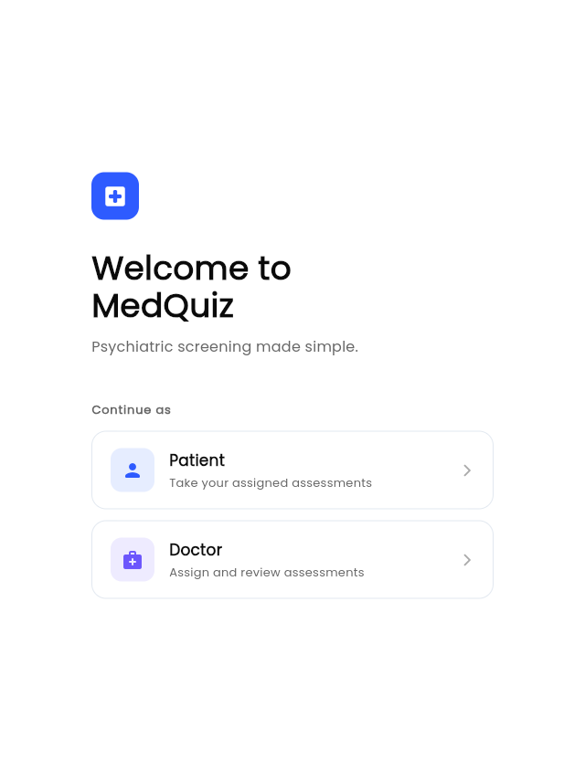

# MedQuiz

[](https://github.com/omprxkash/flutter-app-hci/actions/workflows/ci.yml)
[](https://flutter.dev)

Psychiatric screening, without the clipboard. MedQuiz lets doctors send PHQ-9s, GAD-7s, and MMSEs straight to patients' phones — patients fill them out, the app scores everything automatically, and doctors review results (and can override them when the numbers miss something the conversation didn't).

Built for an HCI course, but designed to actually be usable.

---

## Screenshots



---

## How it works

It's a pretty tight loop:

1. Doctor logs in, sees their patient list, assigns a quiz
2. Patient opens the app, sees the quiz waiting, fills it out
3. App scores it and shows the patient where they land on the severity scale
4. Doctor reviews the result, adjusts the score if needed, adds notes

No paper, no chasing people down for forms. The whole thing runs in-memory by default, so you can try it without setting up a database or Firebase project.

---

## Running it locally

You'll need Flutter 3.44 or later.

```bash
git clone https://github.com/omprxkash/flutter-app-hci.git
cd flutter-app-hci
flutter pub get
flutter run -d chrome
```

Prefer a specific port?

```bash
flutter run -d web-server --web-port 8765
```

---

---

## Quizzes included

| Quiz | Screens for | Score range |
|---|---|---|
| PHQ-9 | Depression | 0–27 |
| GAD-7 | Anxiety | 0–21 |
| MMSE | Cognitive impairment | 0–30 |

Scoring follows the published clinical rubrics. Doctors can also build their own questionnaires from scratch using six question types: text, single-choice, multi-select, scale, number, and yes/no.

One detail worth calling out: if a patient's PHQ-9 has a non-zero answer on Q9 (the suicidal ideation item), the doctor dashboard shows a red alert banner at the top. That felt important to get right, even for a course project.

---

## Data and persistence

Out of the box, everything is in-memory — data resets when you restart the app, which is fine for exploring.

To add real persistence, run `flutterfire configure` and drop the generated file in `lib/core/config/firebase_options.dart`. The app picks it up automatically; no other changes needed.

---

## Tech stack

- **Flutter 3.44 / Dart 3.10**
- **Riverpod 3** for state — one provider file per feature, no god-files
- **go_router 17** with `StatefulShellRoute` for persistent bottom nav
- **google_fonts** — Poppins everywhere, centralized in `AppTypography`
- **Firebase Auth + Firestore** — optional, swappable with the in-memory layer

The architecture is feature-first: `auth`, `doctor`, `patient`, and `quiz` each get their own `domain/`, `data/`, and `presentation/` folders. The domain layer has zero Flutter imports. In-memory and Firebase implementations live side by side in `data/` — switching is a one-liner in the provider.

---

## What's next

- Push notifications nudging patients who haven't started an assigned quiz after a day or two
- Score trend sparklines on the patient detail screen (last 6 results)
- An audit log when a doctor overrides the auto-score
- Real SMS verification once Firebase Auth is wired in

---

## License

MIT. See [LICENSE](LICENSE).
